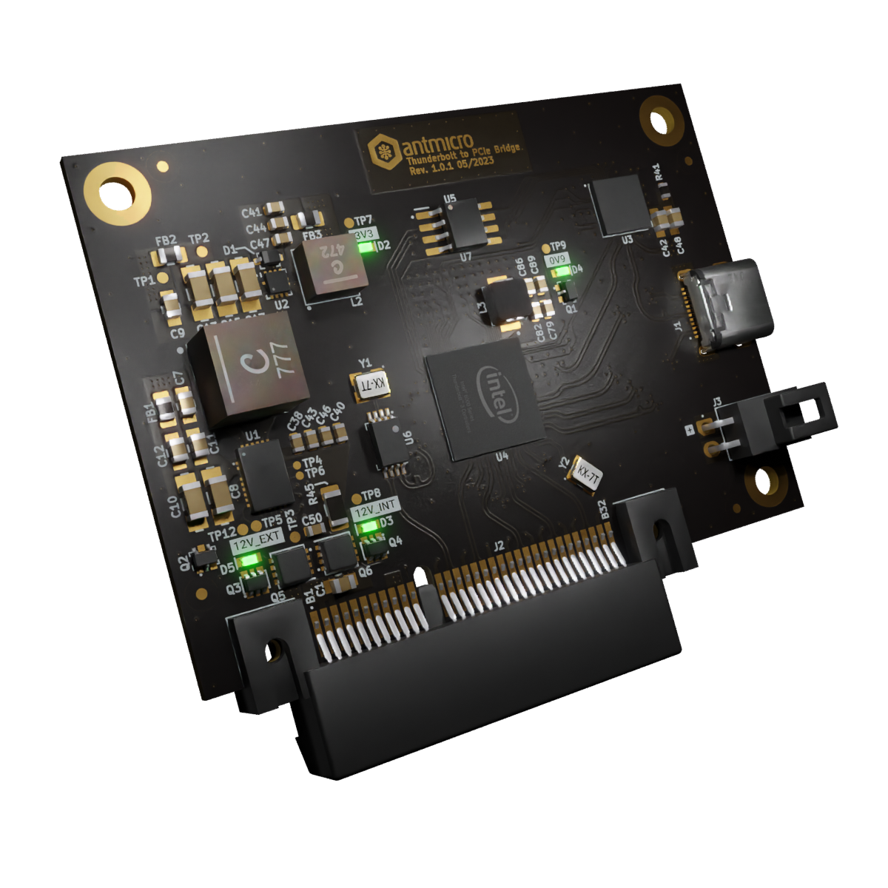

# Thunderbolt to PCIe Adapter

Copyright (c) 2022-2023 [Antmicro](https://www.antmicro.com)

## Overview

This project contains open hardware design files for an adapter board wrapping 4-lane (i.e. 4x) PCIe Gen 3.0 devices into a Thunderbolt 3 uplink.
It is based on the Intel/JHL6340SLLSQ Thunderbolt controller.
The design files were preapared in KiCad 6.x.

## Key features

* Intel JHL6340SLLSQ Thunderbolt 3 controller 
* PCIe x4 expansion slot
* On-board Step-Up DC-DC generating 12V (required by some PCIe cards)

## Project structure

The main directory contains KiCad PCB project files, a LICENSE, and a README.
The remaining files are stored in the following directories:

* `lib` - contains the component libraries
* `img` - contains graphics for this README
* `doc` - contains schematics in pdf form

## Block diagram

## Licensing

This project is published under the [Apache-2.0](LICENSE) license.

